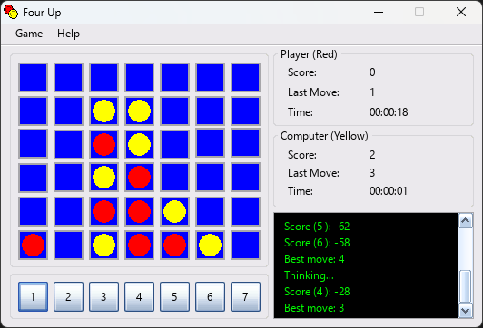

# 4Play

This source code has come a long way. First, I used QuickBASIC 4.5 and and my User Interface Library (TxMUI).
Soon, I upgraded to QuickBASIC Extended 7.0 and TxMUI. Next, I got hold of Visual Basic for DOS and ported the
code to that compiler and changed all the UI code to "Ruby". Eventually, when I started using Visual Basic 6.0
for Windows, I ported this code and once again I had to changed the UI code. And now, thanks to Microsoft,
I have ported the code to Visual Basic .NET! While porting for Visual Basic .NET I modularized and "class"ified
most of the code. Although most of the code was translated by the VB.Net translator, I had To make a lot of changes.
The AI uses a early version of minimax with alpha-beta pruning to find the best move. And I know there are bugs
and it is not well optimized. This code frankly speaking, is open source/freeware. You can do whatever you want
with it. I do not accept responsibility for any effects, adverse or otherwise, that this code may have on you,
your computer, your sanity, your dog, and anything else that you can think of. Use it at your own risk.